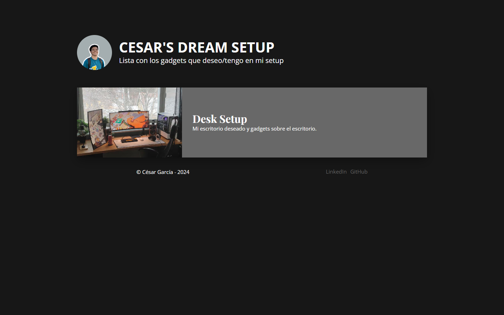

<h1 align="center">Cesar's Dream SetUp</h1>

A primera vista, <a href="https://listsetup.vercel.app/" target="_blank">Cesar's Dream SetUp</a> es una página para optimizar la experiencia del usuario con la vista más manera clara y sencilla

## ✏️ Cosas que aprendí

Aprendí a utilizar el atributo Grid, además de visualizarlo y comprenderlo en el inspector de elementos. Dependiendo de las condiciones, es necesario o más conveniente usar Flexbox. También escribo código responsivo aplicando patrones que integran Grid y Flexbox. Entendí la importancia del modelo BEM (Block Element Modifier), que nos ayuda a crear código reutilizable y ordenado en proyectos de CSS, cuyas reglas se dividen básicamente en tres: bloques, elementos y modificadores.

1. Bloques: Son contenedores. Si una sección es significativa por sí misma y no requiere otras secciones para su apariencia (CSS), debe colocarse en un bloque.
2. Elementos: Parte de un bloque, dependen de este y no tienen significado por sí mismos. Tienen la particularidad de usar el nombre del bloque seguido de un doble guion bajo (__).
3. Modificadores: 쮼l bloque o elemento tendrá una variante? Se usa un modificador, que act칰a como una "bandera" que indica que el elemento tendrá un dise침o diferente.

## 🎨 Color code

| Color           | Hex                                                                |
| ----------------|--------------------------------------------------------------------|
| Azul Oscuro     |  `#1E6079` |
| Gris            |  `#3a3a3a` |
| Blanco          |  `#ffffff` |
| Negro           |  `#000000` |
